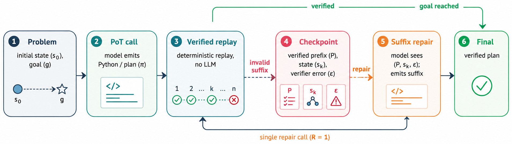

# RePot: Recoverable Program-of-Thought via Checkpoint Repair

[](https://arxiv.org/abs/2605.30052)
[]()

<!-- TODO: repo banner / social-preview image (1280x640). See TODO.md. -->



## What is RePoT

Large reasoning models can write a Python program that solves a puzzle, but a single wrong primitive move silently invalidates the whole plan — so one bad step at move 12 of a 30-step trajectory throws away the other 29. This is a wasteful failure mode: most of the work was right.

**RePoT** treats the plan as a checkpoint, not a final answer. It executes the program in a sandbox, walks the emitted move list through the environment's verifier, stops at the first invalid transition, and asks the model for *one* repair call that resumes from the verified prefix — same problem, but with the trusted state and the verifier's error message in context. No new prompt engineering, no rollout-time search, no fine-tuning.

The result: RePoT costs **at most one extra LLM call** on the ~14% of problems where PoT fails, and beats vanilla PoT by **+3 to +11 percentage points** across four closed-model configurations on PuzzleZoo-775 (peaks at 96.9% vs 86.3% on `gpt-5.4-mini-medium`). It replicates on PlanBench Blocksworld and on four open-weights models. The companion **Derail-550** benchmark isolates *which* signal does the recovery work — answer: the checkpoint state itself, not the specific verified-prefix tail.

We evaluate RePoT against six baselines (CoT, Self-Consistency, PoT, PoT-retry, VEX, RePoT-A) on three benchmarks: **PuzzleZoo-775** (775 stratified instances of Tower of Hanoi, Checker Jumping, River Crossing, Blocksworld at controllable complexity), **PlanBench-Blocksworld-378** (3–12 blocks, third-party replication), and **Derail-550** (550 mid-rollout error injections × 11 recovery conditions). Models tested: four closed-source configurations (`gpt-5.4-mini` ± reasoning, `gemini-3.5-flash`, `claude-sonnet-4.6`) and four open-weights (Qwen3.6-35B-A3B, Gemma-4-26B-A4B-it, gpt-oss-20b, Nemotron-3-Nano-30B-A3B) served via vLLM. Everything is reproducible from `repot run` traces via `repot judge`.

- **Paper**: [arXiv:2605.30052](https://arxiv.org/abs/2605.30052)

## Install

```bash
git clone https://github.com/parsa-mz/RePot && cd RePot
uv sync
```

`uv sync` creates the `.venv` and installs the package together. For dev extras: `uv sync --extra dev`.

## Quickstart

Try it offline (no keys, ~5 seconds):
```bash
repot run --model local_dummy --max-items 3
repot judge data/traces/local_dummy_repot_main.jsonl --print
```

This runs every method against 3 problems using the built-in dummy client, then prints a per-method success-rate table. Useful as a smoke test that everything is wired up.

`repot --help` lists every subcommand and option.

## API keys

For real models you'll need provider keys. Copy `.env.example` to `.env` and fill in whichever you'll use — the file is gitignored:

```bash
cp .env.example .env
# then edit .env
```

| Provider | Variable(s) | Where to get it |
|---|---|---|
| OpenAI (`gpt_5_4_mini*`) | `OPENAI_API_KEY` | <https://platform.openai.com/api-keys> |
| Anthropic (`claude_*`) | `ANTHROPIC_API_KEY` | <https://console.anthropic.com/settings/keys> |
| Google Gemini (Vertex) | `GOOGLE_CLOUD_PROJECT`, `GOOGLE_CLOUD_LOCATION` (+ `gcloud auth application-default login`) | <https://aistudio.google.com/app/apikey> |
| Open-weights via vLLM | `REPOT_OPENAI_BASE_URL`, `REPOT_API_KEY` | bring up `vllm serve <model>` yourself |

You only need the keys for the providers you actually call — set zero and `local_dummy` still works.

## CLI

| Command | What it does |
|---|---|
| `repot run` | Run inference (PoT, RePoT, RePoT-A, VEX, CoT, SC) on a problem set; emit a trace JSONL. |
| `repot derail` | Run the Derail-550 controlled-recovery experiment. |
| `repot judge` | Aggregate a trace JSONL (or directory) into a summary JSON. |
| `repot benchmark` | List or inspect the bundled benchmarks. |

## Datasets

| File | Records | Description |
|---|---:|---|
| `data/problems/puzzlezoo_775.jsonl` | 775 | PuzzleZoo-775: stratified puzzle benchmark across 4 environments. |
| `data/problems/planbench_blocksworld.jsonl` | 378 | PlanBench Blocksworld adapter (3-12 blocks). |
| `data/derail/derail_550.jsonl` | 550 | Derail-550: mid-rollout injection case definitions. |

See [`data/README.md`](data/README.md) for schemas and provenance.

## Running experiments

Model traces aren't shipped; regenerate the ones you need. The two main entry points:

```bash
# Headline inference run on PuzzleZoo-775
repot run --config configs/repot_main.yaml --model gpt_5_4_mini_medium

# Derail-550 recovery experiment (PuzzleZoo cases × 11 recovery conditions)
repot derail --config configs/derail_experiment.yaml --model gpt_5_4_mini_medium
```

Both write a JSONL trace to `data/traces/<model>_<config-stem>.jsonl`. To run against an open-weights model, start vLLM yourself and point `REPOT_OPENAI_BASE_URL` at it:

```bash
vllm serve Qwen/Qwen3.6-35B-A3B --port 8000 &
repot run --config configs/repot_main.yaml --model qwen3_6_35b_a3b --workers 14
```

Extract metrics from any trace (or a directory of traces) with:

```bash
repot judge data/traces/<...>.jsonl --print
```

This writes a `<trace>.summary.json` alongside the trace and (with `--print`) renders a per-method × per-environment success-rate table.

For a smaller sweep, use `--max-items N` and `--methods-only pot,repot`. For exact paper numbers, run on the full dataset across the 4 closed + 4 open-weights configurations in `configs/models.yaml`.

## Tests

```bash
uv run pytest tests/
```

Tests are deterministic and do not call any external APIs.

## Citation

```bibtex
@article{mazaheri2026repot,
  title  = {RePoT: Recoverable Program-of-Thought via Checkpoint Repair},
  author = {Mazaheri, Parsa},
  year   = {2026},
  eprint = {2605.30052},
  archivePrefix = {arXiv},
}
```

## License

- **Code**: Apache-2.0 — see [`LICENSE`](LICENSE).
- **Datasets** (`data/`): CC-BY-4.0.
